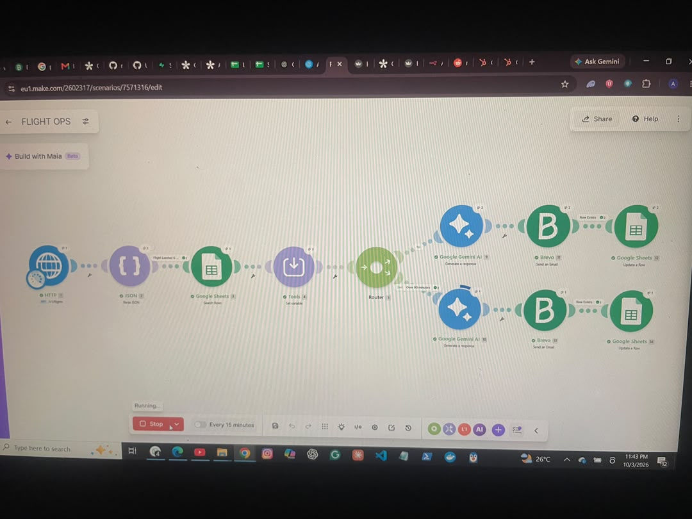
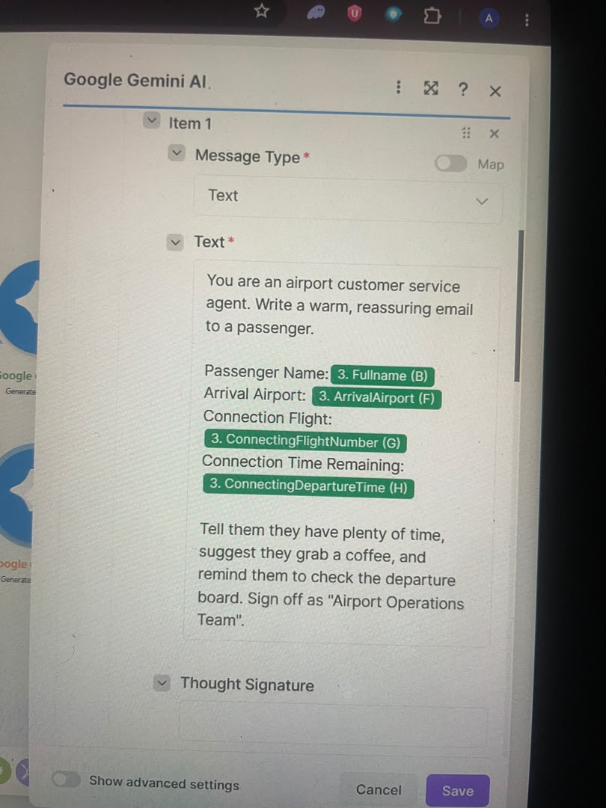
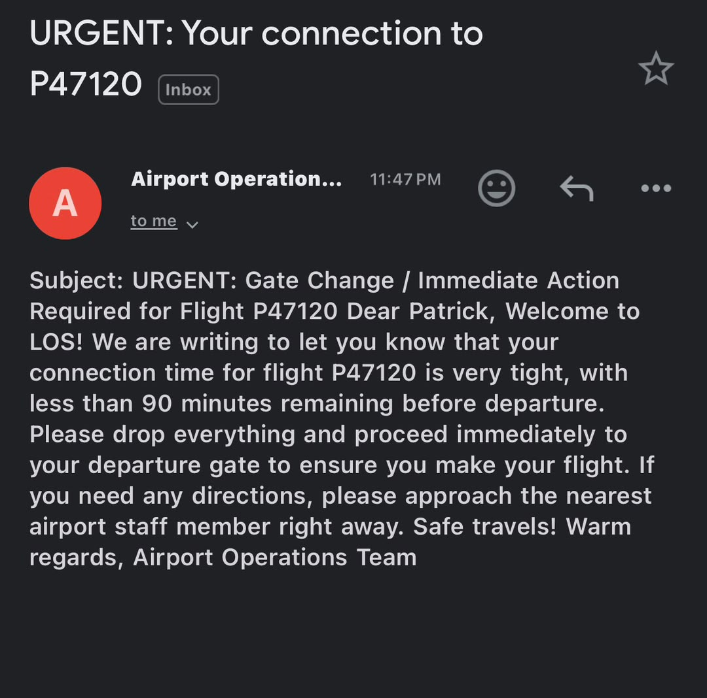
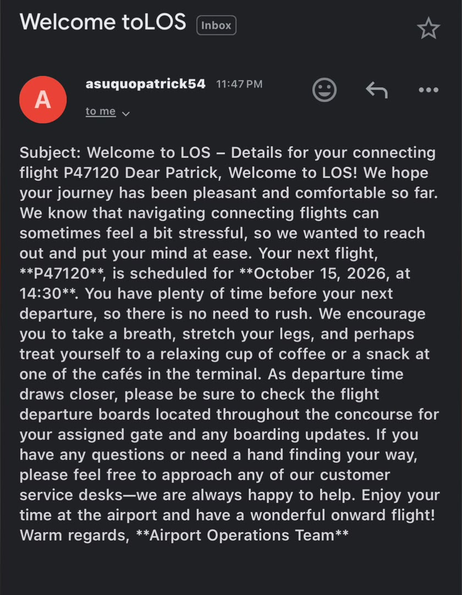

# ai-flight-ops-agent
AI-powered flight monitoring and passenger connection alert system built in Make.com
# ✈️ AI Flight Operations & Passenger Connection Agent

An AI-powered automation that monitors arriving flights in real time, matches passengers against a live database, calculates connection windows, and sends personalized alerts — without human intervention.

## 🎯 The Problem

Airport operations teams struggle to notify passengers about tight connections. Manual monitoring doesn't scale, and generic alerts ignore real-time delays and each passenger's actual connection window.

## 💡 The Solution

A Make.com automation that:

1. Monitors arriving flights via the **AviationStack API**
2. Matches passengers from a live **Google Sheets** database
3. Calculates the connection window dynamically
4. Routes passengers into two lanes: **urgent (< 90 min)** and **relaxed (> 90 min)**
5. Uses **Google Gemini** to generate personalized emails per passenger
6. Dispatches via **Brevo** and logs to the database to prevent duplicates

## 🛠 Tech Stack

- **Make.com** — orchestration
- **AviationStack API** — live flight data
- **JSON Parser** — data extraction
- **Google Sheets** — passenger database
- **Google Gemini** — AI message generation
- **Brevo** — transactional email

## 🏗 Architecture
## 🔑 Key Features

- Real-time API integration with AviationStack
- Custom date math using `parseDate()` and millisecond subtraction
- Conditional routing based on the 90-minute connection threshold
- AI-generated personalized messages for each passenger
- Idempotent database updates to prevent duplicate emails
- Graceful error handling — filters block missing data instead of crashing

## 📸 Screenshots

### Scenario Canvas

### AI Prompt Design

### Sample Output — Urgent Lane

### Sample Output — Relaxed Lane

## 📦 Blueprint

The complete Make.com blueprint is available at [`blueprint/flight-ops.json`](blueprint/flight-ops.json). Import directly into your Make.com workspace to replicate this automation.

## 📈 Business Value

- **Eliminates manual flight monitoring** — no more ops staff watching flight boards
- **Improves passenger experience** — personalized, timely alerts
- **Scales to unlimited passengers** — no additional headcount required
- **Prevents missed connections** — passengers know exactly when to move

## 👤 Author

**Patrick Asuquo** — AI Automation Specialist

[LinkedIn](https://linkedin.com/in/YOUR-PROFILE) · [Email](mailto:asuquopatrick54@gmail.com)

